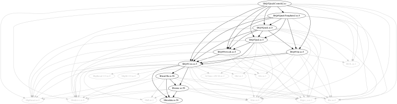

# copydeps

## Introduction

copydeps is a tool to analyze and copy the dependencies of ELF binaries, as
used on Linux and other UNIX systems. It is useful to create light,
self-contained installers.

It works on both executables and libraries.

## Requirements

- A Linux system (copydeps might work on BSD systems, but this has not been
  tested)
- Python 3
- [pyelftools](https://github.com/eliben/pyelftools)
- ldd

## Installation

Install with `./setup.py install` or just run `copydeps.py` from the source
tree.

## Usage

### Copying dependencies

Assuming you want to copy all dependencies of the `foo` binary to the current
directory, run:

    copydeps /path/to/foo -d .

The list probably includes way too many libraries you can assume to be
installed on the destination system. To tell copydeps to ignore them, create a
exclude list file (you can have a look at `exclude-list.sample` for
inspiration) and run it like this:

    copydeps --exclude your/exclude-list /path/to/foo -d .

### Analyzing dependencies

You can tell copydeps to generate a dependency diagram using the `--dot`
option.  If you just want to look at the dependency diagram, add the
`--dry-run` option to prevent copying:

    copydeps --exclude your/exclude-list /path/to/foo --dry-run --dot foo.dot

You can now view the diagram using any Graphviz viewer, such as [xdot][].

As an example, here is the dependency diagram of Qt5QuickControls2:

[xdot]: https://github.com/jrfonseca/xdot.py

## Limitations

copydeps does not detect libraries loaded with `dlopen()`.
